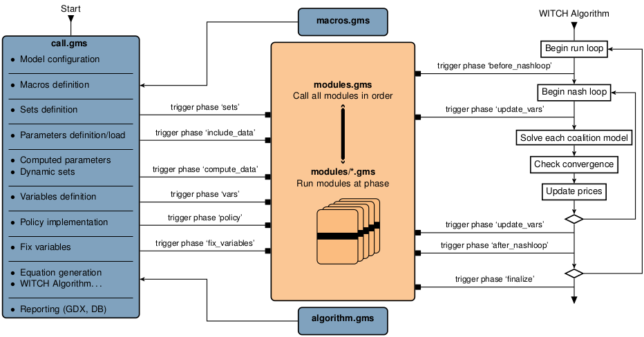

# Appendix

## Flowchart

The flowchart of the WITCH model shows the different steps in the model generation and algorithm.




## List of parameters, variables, GAMS names, and parameter values

```{r, echo=F}
library(data.table)
sym_witch = fread("symbols.csv",sep=",",header=T)
#tab = sym_witch[id %in% 1:1000,.(Symbol,Definition,GAMS,Unit)]
tab = sym_witch[,.(Symbol,Definition,GAMS,Unit)]
knitr::kable(
tab, booktabs = TRUE,
caption = 'Symbolic terms and GAMS names of the main variables and parameters'
)
```


