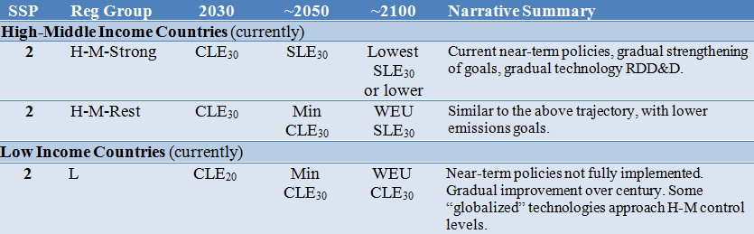

## Air pollutant emissions

The air quality module relates the pollution economic activities to
emission levels. It originates from the LIMITS project and
its emission factors originate from TIMER technological model using GAINS emission factors. 

The current version uses [SSP2](ssp_implementation) as the BAU scenario, according to Fig. 1.

The air pollutants **aqe** are : carbon monoxide **CO**, methane **CH4**, 
black carbon **BC**, organic carbon **OC**, Sulfur dioxide **SO2**,
Nitrogen oxides **NOx**, ammonia **NH3** and volatile organic compounds **VOC**.

This modules uses the input file data_aq.gdx, where the emission factors, the [RCP](http://tntcat.iiasa.ac.at:8787/RcpDb/dsd?Action=htmlpage&page=welcome) population and emissions,
the sectoral fractions (used in the project LIMITS - end use sectors ([SNAP sectors](http://www.emep.int/UniDoc/node7.html)), the RCP downscaling factors,
the non energy emissions ([TIMER](http://www.pbl.nl/sites/default/files/cms/publicaties/461502024.pdf)) and the maximal reductions percentage are set and calculated exogenously.

The emission factors $ef_{j,p}(t)$ are calculated using the ratio of emissions(E) over activities(A) provided by TIMER, and 
the emissions and activities are first aggregated over the WITCH sectors (see mapping on the table bellow), 
$$
 ef_{j,p}(t) = \frac{E_{j,p,\text{TIMER}}}{A_{j,\text{TIMER}}} ,
$$
where $j$ are the WITCH sectors and $p$ is the pollutant.

The emission factors are then aggregated, with a weighted mean, according to their CO$_2$ emissions.

In the WITCH model we use the activities related with the fuel use and the type of electricity generation technologies
to compute the emissions E of pollutant p at time period t according to:

$$
 E_{p} = \sum_{j}^{ } A_{s}ef_{s,p}(t)
$$
where $ef_{j,p}(t)$ is the controlled emission factor for activity category j and for pollutant.
The $ef_{j,p}(t)$ are defined per air pollution scenario, which correspond to different levels of End-of-Pipe (EOP) measures. The air pollution scenarios are CLE (current legislation), SLE (stringent legislation) and MFR (maximum feasible reduction). The CLE scenario corresponds to the implementation until 2030 of all the legislation already (in 2013) foreseen for that period; The SLE scenario foresees the implementation of 75% of the MFR scenario which corresponds to the maximal technological frontier of EOP. 

The emissions of the exo-sectors (sectors that are related to energy but are not accounted in the model directly, see the following table), are taken from TIMER directly and set exogenously. 

The pollutant NH~3~ and some sectors such as Solvents, Waste (landfills, waste water, non-energy incineration), Agriculture waste burning on fields, Agriculture, Grassland burning and Forest burning are completely exogenous to the model. Their emissions follow the RCP8.5 emissions.

For the SSP implementation the emissions for these emission sectors vary over time following the average (across the WITCH sectors) variation of that given pollutant over time.

All the air pollution emissions are scaled in such way that the 2005 value corresponds to the RCP2.6 2005 value.

### Other Air pollution Options/branches

### AQ_kuznets

In this branch the emission factors are controlled endogenously, its implementation follow the methodology applied by @SmithPitcherWigley2005.
$$
 ef_{j,p}(t)=ef_{j,p}^{'}(t)\left ( 1 - fc_{j,p}(t) \right )
$$

where $ef_{j,p}^{'}(t)$ is the maximal uncontrolled emission factor and $fc_{j,p}(t)$ is the percentage of control.
$fc_{j,p}(t)$ were provided by the LIMITS project and are based on the methodology of Smith *et al.*, 2005.

### AQ_endog

In this branch one can define air pollution policies, in terms of EOP and most importantly of structural measures. 
Structural measures will induce a change in the energy system since they cap the emissions of the most pollutant technologies.
These are specified as a percentage of reduction with respect to 2010 levels that decreases linearly until 2030. For the moment only SO$_2$ reductions have been implemented.

The structural measures are accounted for until 2030, setting:    

$$
emissnoreduc(p,t,n) =  \frac{(E_{p,j,t=2010,n} * (1-ra)) - E_{p,j,t=2010,n}}{(2030-2010)*(t-2010)} + E_{p,j,t=2010,n} ,
$$  
where $emissnoreduc(p,t,n)$ is the emission cap of pollutant $p$ and region $n$ in time $t$, and $ra$ is the fraction of reduction.
After 2030 the emission cap is the same as in 2030.

The implementation of EOP measures is done as follows:

$$
ef_{j,p}(t) = (-ef_{j,p,\text{BAU}}(t) + ef_{j,p,\text{MFR}}(t))*reduca + ef_{j,p,\text{BAU}}(t),
$$
where $reduca$ is the fraction of reduction due to EOP measures.
