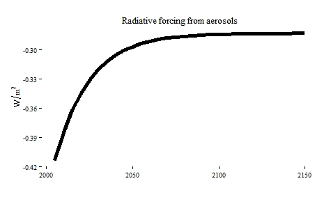

## Climate module

The climate module translates the regional emissions into global 
temperature through atmospheric concentrations.
It originates from the DICE climate equations [@NordhausSztorc2013].

By default, the climate equations are computed offline, i.e. after the model's optimization,
but the equations can also be included in the model's optimization
when the climate feedback is required.

The greenhouse gases **ghg** are : carbon dioxide **CO2**, methane **CH4**, 
oxide nitrous **N2O**, short-lived greenhouse gases **slf**, 
long-lived greenhouse gases **llf**.

### World GHG emissions

The regional emissions $Q_E(\text{ghg},t,n)$ are summed up into global emission $WE(\text{ghg},t)$ and converted into Gton equivalent carbon.

$$
	WE(\text{ghg},t) = \sum_n \frac{Q_E(\text{ghg},t,n)}{\text{wemi2qemi}(\text{ghg})}
$$

Non-CO~2~ greenhouse gases are converted in CO~2~ equivalent using the 
the global warming potentials over a time horizon of 100 years (AR4 IPCC report, 2007)
and in carbon equivalent by multiplying by 12/44.

$$
	\text{wemi2qemi}(\text{oghg}) = \text{gwp}(\text{oghg}) \times 12 / 44
$$

 | GHG   | emi_gwp | 
 | ---   | ------- | 
 | CO~2~ | 1       | 
 | CH~4~ | 25      | 
 | N~2~O | 298     | 
 | slf   | 1430    | 
 | llf   | 22800   | 

### Carbon-cycle

The carbon-cycle model is a 3-layer model calibrated to MAGICC [@MeinshausenRaperWigley2011], described in Equation **eqwcum_emi_co2**.
The carbon dioxide emissions go into the atmosphere box **a** and alter
the atmospheric carbon concentration, then the carbon is exchanged
through the ocean-biosphere-atmosphere carbon fluxes.
The ocean carbon sink is divided in
two layers: the upper layer **u** (shallow oceans)
and the lower layer **l** (deep oceans).
In this representation, the upper layer also includes the biosphere.

The CO2 concentrations $M_{\text{box}}(t)$ are denoted, in the model, World cumulative emissions **WCUM_EMI(CO2,box,t)** and are expressed in GtC.

The carbon cycle is described in the model as 

\begin{align*}
   M_a(t+1) & =  \mathbf{A}_{a,a} \times M_a(t) + \mathbf{A}_{u,a} \times M_u(t) + \Delta_{\text{t}} \times WE(\text{CO}_2,t)\\
   M_u(t+1) & =  \mathbf{A}_{a,u} \times M_a(t) + \mathbf{A}_{u,u} \times M_u(t) + \mathbf{A}_{l,u} \times M_l(t)\\
   M_l(t+1) & =  \mathbf{A}_{u,l} \times M_u(t) + \mathbf{A}_{u,l} \times M_l(t)\\
\end{align*}

$\Delta_{\text{t}}=5$ and is the number of years in one time step, and
the transition matrix is

$$
   \mathbf{A}=
   \begin{pmatrix}
   {0.88} & {0.04704} &            \\
   {0.12} & {0.94796} & {0.00075} \\
              & {0.005  } & {0.99925} \\
   \end{pmatrix}
$$

Initial CO2 stocks in 2005 are reported below.

 | Stock in 2005  | emi_gwp | 
 | ---            | ------- | 
 | $M_a(2005)$    | 808.9   | 
 | $M_l(2005)$    | 10000   | 
 | $M_u(2005)$    | 1000    | 

### Accumulation of non-CO2 ghg in the atmosphere

the non-CO2 greenhouse gases are accumulated in the atmosphere as follows:

\begin{align*}
   M(\text{oghg},\text{atm},t+1) =& d_1(\text{oghg})^{\Delta_t}\times M(\text{oghg},\text{atm},t) +\\
   &d_2(\text{oghg},t)\times \frac{1}{2}\left(E(\text{oghg},t)+E(\text{oghg},t+1)\right)+\\
   &(1-d_1(\text{oghg})^{\Delta_t})\times \overline{\text{stock}}(\text{oghg})
\end{align*}
where $d_1(\text{oghg})$ is the yearly retention factor, and $d_2(\text{oghg},t)$ is the one-period retention factor, which is however kept constant.

**stock(oghg)** is the stock of each greenhouse gas at equilibrium, which is not subject to decay, and expressed in GtC. It is calculated as a fraction of $stock_0$, the stock of non-CO2 greenhouse gases in 2005.

 | ghg    | cmdec1 | cmdec2 | emi_eqstock | emi_stock0 | 
 | ---    | ------ | ------ | ----------- | ---------- | 
 | CH$_4$ | 0.917  | 4.2361 | 1.9352      | 4.838      | 
 | N$_2$O | 0.9917 | 4.9177 | 1.3411      | 1.524      | 
 | slf    | 0.931  | 4.3560 |             | 0.000347   | 
 | llf    | 0.9997 | 4.9969 |             | 0.000848   | 

### Radiative Forcing

The radiative forcing of all greenhouse gases $F(t)$ are summed up in Equation **eqrf_tot**:

$$
   F(t) = \sum_{\text{ghg}} RF(\text{ghg},t) + RF_{\text{aerosols}}(t)
$$

The exogenous radiative forcing from aerosols are based on the average response obtained from many runs and MAGICC outputs.

The CO2 radiative forcing is calculated according to the  [IPCC Third Assessement Report expressions](http://www.ipcc.ch/ipccreports/tar/wg1/222.htm##635),
proportional to the natural logarithm of the ratio of the current concentration
to preindustrial levels (Eq. **eqrf_co2**). $M_{\text{pre}}$ are the preindustrial CO$_2$ concentration level in GtC.

\begin{align*}
   RF(\text{CO}_2,t) = \alpha \times \left(\ln(M(\text{CO}_2,\text{atm},t))-\ln(M_{\text{pre}})\right)
\end{align*}

 | parameter        | value  | 
 | ---------        | -----  | 
 | $\alpha$         | 5.35   | 
 | $M_{\text{pre}}$ | 592.14 | 

The radiative forcing of the non-CO2 ghg are computed in Equation **eqrf_oghg_exp**. We detail hereafter the various expressions.

The radiative forcing of the greenhouse gases CH4 and N2O is given below.
In reality, these radiative forcing are interdependent and have a complex
formulation. An approximation is obtained using the term *inter* in the equations.

\begin{align*}
   RF(\text{oghg},t) =& \text{inter} \times \text{fac} \times 
   \left(
   \sqrt{\text{stm}\times M(\text{oghg},t)} - 
   \sqrt{\text{stm}\times M_{\text{pre}}(\text{oghg})}
   \right),\\
   &\text{oghg}\in \{\text{CH}_4,\text{N}_2\text{O}\}
\end{align*}

 | Parameter        | CH$_4$ | N$_2$O | 
 | ---------        | ------ | ------ | 
 | inter            | 0.85   | 0.92   | 
 | fac              | 0.036  | 0.12   | 
 | stm              | 351    | 206.7  | 
 | $M_{\text{pre}}$ | 1.95   | 1.29   | 

The radiative forcing of slf and llf are proportional to the concentration levels. 

$$
   RF(\text{oghg},t) = \text{fac}(\text{oghg}) \times M(\text{oghg},t), \text{oghg}\in \{\text{slf},\text{llf}\}
$$

 | parameter | slf   | llf    | 
 | --------- | ---   | ---    | 
 | fac       | 2.571 | 13.026 | 

### Global temperature increase from pre-industrial levels

The temperature est determined by Equations **eqtemp_atm** and **eqtemp_low**

The global temperature increase from pre-industrial level $T(t)$
is obtained from the energy balance 2-layer model.

$$
   T(t+1)= T(t) +
   \sigma_1 \times \left(F(t) -
   \lambda \times T(t)-
   \sigma_2 \times \left(T(t)-T^{o}(t)\right)\right).
$$

$\sigma_1$ is a lag parameter. 
$\sigma_2$ is a atmosphere-ocean exchange coefficient.
The climate feedback parameter $\lambda=\frac{4.1}{s}$,
where $s$ is the climate sensitivity.

The ocean temperature $T^{o}(t)$ is given as
$$
   T^{o}(t+1) = T^{o}(t) + \sigma_{ho} \left(T(t) - T^{o}(t)\right),
$$
where $\sigma_{ho}$ is a coefficient of the heat capacity of the ocean. 

 | Parameter     | Value   | 
 | ---------     | -----   | 
 | $\sigma_1$    | 0.208   | 
 | $\sigma_2$    | 0.31    | 
 | $\sigma_{ho}$ | 0.05    | 
 | $\lambda$     | 1.36667 | 
 | $s$           | 3.0     | 

