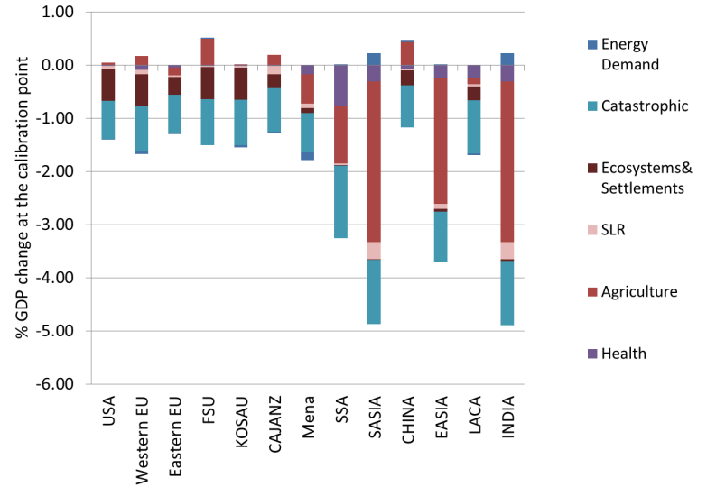

# Impacts and Adaptation

## Economic impacts from climate change

In the WITCH model, a set of regional reduced-form damage functions ($\Omega$) links the global temperature increase above pre-industrial levels to changes in regional gross domestic product (Y):

\begin{equation}
    Y(t,n) =  \frac{tfp_0(n)
                      \left( \alpha(n)
                        \left( tfp_y(t,n) K_C(t,n)^{\beta(n)}l(t,n)^{(1-\beta(n))}
                        \right)^{\rho} + 
                        (1-\alpha(n)) ES^{\rho}(t,n)
                      \right)^{\frac{1}{\rho}}
                    }{\Omega(t,n)},
\end{equation}
 
Adaptation reduces the extent to which temperature increase affects output:

$$
    \Omega(t,n) = 1+ \frac{\Big(\omega_{1,n}^-T(t,n) + \omega_{2,n}^-T(t,n)^{\omega_{3,n}^-}+\omega_{4,n}^-\Big)}{1+Q(ADA,t,n)^{\epsilon(n)}}
    + \Big(\omega_{1,n}^+T(t,n) + \omega_{2,n}^+T(t,n)^{\omega_{3,n}^+}+\omega_{4,n}^+\Big)
$$	
  
To compute the economic damages measured as percentage of GDP, they can be computed from $\Omega(t,n)$ readily as 

$$
Damages(\%\ of\ GDP) = 1 - \frac{1}{\Omega(t,n)}
$$

### Calibration

The main data sources are the FP7 ClimateCost project [@BoselloEboliPierfederici2012] and [@Nordhaus2008]. The details are described in @BoselloDeCian2014.

Market impact estimates are from the FP7 ClimateCost project [@BoselloEboliPierfederici2012]. We consider the economic impacts of climate change on the rise in sea-level, energy demand, and agricultural productivity as estimated by the recursive-dynamic computable general equilibrium (CGE) model ICES [@BoselloEboliPierfederici2012]. Therefore, the market damage component is net of the autonomous adaptation and the $\omega_{i,n}$ coefficients account for autonomous adaptation to market impacts. 

The non-market damage component includes ecosystem losses, non-market health impacts, and catastrophic damages. Damage estimates for health and catastrophic damage are from @Nordhaus2008. Only for Europe do health impacts also include the impacts on labour productivity estimated in ClimateCost by @KovatsLloydHuntEtAl2011. @NordhausBoyer2000 cite unpublished estimates of the capital value of climate-sensitive human settlements and natural ecosystems in each sub-region, and estimate that each sub-region has an annual WTP of 1% of the capital value of the vulnerable system for a 2.5°C temperature increase (0.1% of GDP in the USA).  They  adjust the willingness to pay for income levels. [@BoselloDeCian2014] replaces Nordhaus and Boyer’s estimates with updated calculations of the WTP following the approach used in the MERGE model [@ManneRichels2005]. [@BoselloDeCian2014] follow a similar approach, but as proxy for the WTP they use the EU expenditure on environmental protection, which gives a value equal to 0.6% of EU25 GDP, or equal to 120 euros per capita. A S-shaped relationship between per-capita income and WTP is used to compute the WTP in the different model regions.

The Figure below decomposes regional climate impacts at the calibration point by impact category.

