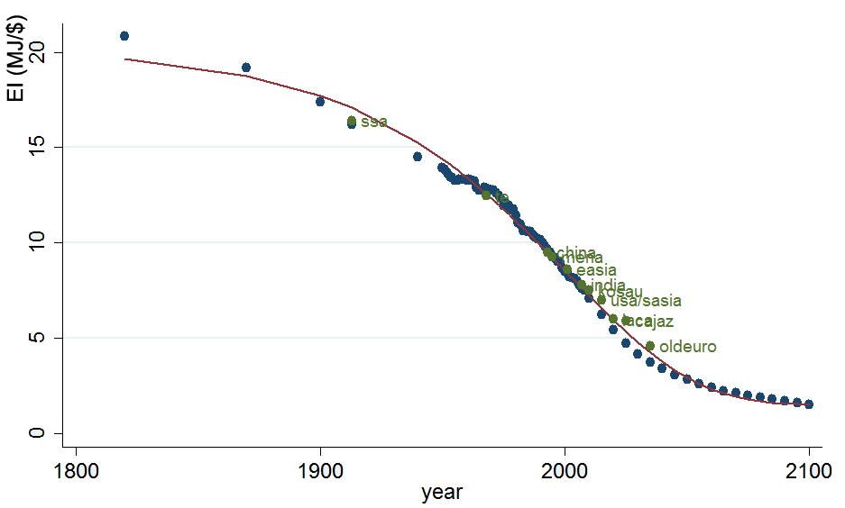

## Dynamic calibration of Productivity and Energy Demand

Once the nested production function of the economy is calibrated using the price and quantity data of the base year, the dynamic calibration module is used to calibrate crucial input parameters that change over the time horizon. The idea is to replicate certain stylized facts about the dynamics of crucial variables to calibrate parameters that have not (yet) been endogenized in the model. 
For the moment, this includes three main series of parameters: population, total factor productivity $tfpy(n,t)$, and the productivity of energy (the inverse of energy intensity) $tfpn(n,t)$.


### Population

**Population** forecasts are taken from the common scenarios that have been developed at IIASA (International Institute for Applied Systems Analysis) and the OECD based on individual country forecasts. We use the OECD projection developed for the SSP2 "middle of the road" scenario aggregated over WITCH regions.

### Total Factor Productivity

Similarly, **GDP** baseline projections have been developed at the OECD and are common across different models. These GDP baseline forecasts are done using Purchasing Power Parities (PPP) and for individual countries. We convert the data into USD using market exchange rates using the conversion factor of 2005. Given that current calibration of all prices and quantities is in MERs and projecting PPP/MER convergence rates is notoriously difficult, for now we keep the exchange rates kept constant and aggregate the MER converted series over WITCH regions, denoted by $Y_{kali}(n,t)$.

The GDP projected by the model is then used to calibrate the time series of total factor productivity $tfpy(t,n)$ for the model. The data series from the OECD are given until the year 2100. In order to obtain the data until the time horizon of WITCH, the GDP is extrapolated continuing with the growth rate in 2100 but decreasing it linearly to zero growth at the end of the time horizon.
All baseline data can be accessed at the [SSP database](https///secure.iiasa.ac.at/web-apps/ene/SspDb). The total number of countries available from the database is 184 and thus covering over 95 of the world population.


### Energy Intensity

In order to calibrate energy demand across regions and over time, an estimated energy demand elasticity is used to compute total primary energy supply (PES) across regions and over the time horizon.
The calibration of factor productivity of energy services (tfpn) is run based on the SSP2 default scenario. The following income elasticity rule is used for the different regions:
Industrialized countries (OECD members) are characterized by an elasticity of 0.40 in 2005 whereas non-OECD members have an elasticity of 0.55 based on the higher share of energy expenditures. To take into account economic progress and convergence, the elasticity is assumed to fall exponentially to finally reach a value of 0.2 in the year 2150.
These assumptions are based on the stylized facts that energy intensity tends to converge across regions, and that energy demand income elasticities are higher in developed countries, see e.g.,  @Stern2012, @WebsterPaltsevReilly2008 and @MahadevanAsafu-Adjaye2007.

This table shows the income elasticities of energy used for the calibration:

 | Region   | Income elasticity of Energy [2005] | Income elasticity of Energy [2150] | 
 | ------   | ---------------------------------- | ---------------------------------- | 
 | OECD     | 0.40                               | 0.20                               | 
 | non-OECD | 0.55                               | 0.20                               | 


The following graph illustrates global energy intensity defined as PES over GDP(PPP) in MJ/$ and the 2005 values of the WITCH regions plotted in which year global EI reached their respective values:



The income elasticity of energy for each year and region is then computed asuming a constant growth rate over the time horizon (30 periods). Therefore, we can obtain the set of elasticities as

$$
\varepsilon_{Y,E}(n,t)=\varepsilon_{Y,E}(n,2005)\times e^{t/30}\times log(\varepsilon_{Y,E}(n,2150))/\varepsilon_{Y,E}(n,2005))
$$ 

Based on these elasticities, the projected energy demand can be computed based on the GDP projection. Since the  GDP the model is calibrated in the above way  to the projection by the OECD ($Y_{kali}(n,t)$), the predicted demand for total primary energy in each region and at each time $TPES_{kali}(n,t)$ is computed iteratively as

$$
TPES_{kali}(n,t)=TPES_{kali}(n,t-1)\times(1+\varepsilon_{Y,E}(n,t))\left(\frac{Y_{kali}(n,t)}{Y_{kali}(n,t-1)}-1\right)
 $$.

During the process of the dynamic calibration, the model is run and iteratively both factor productivity parameters are updated until the projected GDP and total primary energy demand  converge sufficiently close to the calibration values.


```{r, echo=F}
library(data.table)
sym_witch = fread("symbols.csv",sep=",",header=T)
tab = sym_witch[id %in% 173:177,.(Symbol,Definition,GAMS,Unit)]
knitr::kable(
tab, booktabs = TRUE,
caption = 'Capital accumulation symbolic terms'
)
```


