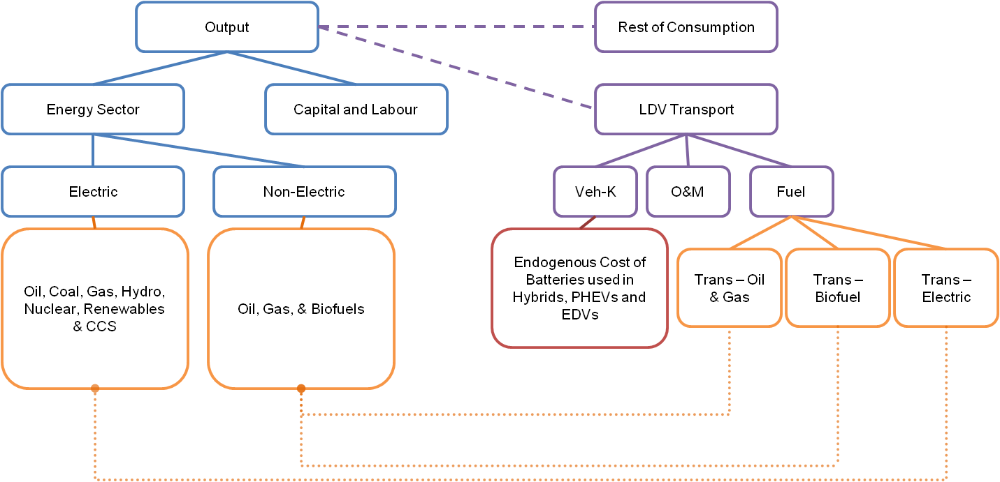

## Personal transport

 
The personal transport module contains the sub-model representation of a light duty vehicle (LDV) transport sector within WITCH. 
It is the extension of the code used to produce [@BosettiLongden2013].

The vehicle types **jveh** are:

*  traditional combustion vehicles **trad_cars**; 

*  hybrid vehicles **hybrid**;

*  plug-in hybrid vehicles **plg_hybrid**; 

*  electric drive vehicles **edv**.

The figure below shows how the structure of the LDV transport sector fits within WITCH.
The composition of vehicle types (denoted in the figure as Veh-K) is determined by a Leontief function of a range of different costs. 
These comprise the vehicle cost, including battery cost ($/kWh), O&M costs, fuel costs and any associated carbon costs based on the fuel mix within the sector.
Fuels are sourced from the Energy sector and decreases in the cost of vehicles are driven by R&D investments in battery technologies. 

### Number of Vehicles

The number of vehicles per thousand capita $ldv\_pthc(t,n)$ is set equal to an exogenous projection and is computed before the model iterates through the nash loop. The calculation of vehicles has been sourced from the IEA/SMP model which is in turn based on the work of @DargayGately1999.
The following equation has been implemented with parameters set to those in the table below. In particular, the Autonomous Increase (AI) and the Ownership Growth Elasticity (OGE) values depend on the gdp per capita and on the relevant ownership level.

$$
	ldv\_pthc(t,n) = ldv\_pthc(t-1,n) \times \left(1+(\frac{gdp\_pc(t,n)}{gdp\_pc(t-1,n)}-1)\times OGE\right)+AI
$$

 | gdp_pc levels | Maximum ownership level          | Ownership Growth Elasticity (OGE) | Autonomous Increase (AI) | 
 | ------------- | -----------------------          | --------------------------------- | ------------------------ | 
 | $\le$ $5000   | no maximum                       | 0.30                              | 3                        | 
 | $>$ $5000     | 300 vehicles per thousand capita | 1.30                              | 3                        | 
 | $>$ $5000     | 500 vehicles per thousand capita | 0.60                              | 3                        | 
 | $>$ $5000     | 600 vehicles per thousand capita | 0.25                              | 4                        | 
 | $>$ $5000     | n/a                              | 0.10                              | 4                        | 

The total number of vehicles is obtained multiplying this value by the population.

$$
	ldv\_total(t,n) = ldv\_pthc(t,n) \times population(t,n)
$$

The composition of the vehicle fleet is then determined by the optimization model, where a linear competition among the vehicle types takes place (mitigated by the presence of restrictions and constraints, described hereinafter).

$$
	ldv\_total(t,n) = \sum_{jveh} K_{EN}(jveh,t,n)
$$

### Kilometre Demand, Fuel Consumption and Energy

Energy consumption associated to the different vehcile types is described by [Eq. **eqq_en_veh**]:

$$
	Q_{EN}(jveh,t,n) = fuel\_cons(jveh,t,n) \times K_{EN}(jveh,t,n)
$$

Fuel consumption is calculated starting from travel intensity, derived from IEA/SMP and considered constant over time in the different regions, according to the following scheme:

$$
	km\_demand\_ldv(t,n) = travel\_intensity(t,n) \times GDP(t,n)
$$

$$
	km\_demand\_pv\_ldv(t,n) = km\_demand\_ldv(t,n) / ldv\_total(t,n)
$$

$$
        km\_dev(t,n) = km\_demand\_pv\_ldv(t,n) / km\_demand\_pv\_ldv\_2005(n)
$$

$$
        fuel\_cons(jveh,t,n) = fuel\_cons\_2005(jveh,n) \times km\_dev(t,n) \times t^{fueleff\_rate(t,n)}
$$
          
### Cost of Vehicles

While the cost of traditional combustion vehicles is held constant at 2005 levels, the cost of battery integrated vehicles decreases with investments in R&D for batteries.

An example of how the cost of batteries impacts the cost of ldvs is shown in the following line of code focused of EDVs [Eq. **eqmcost_inv_edv**]  

$$
   veh\_cost(\text{edv},t,n)  = {inv\_cost\_trad\_cars \times 0.75 + size\_battery(\text{edv},t,n) \times MCOST\_INV(\text{battery},t,n)}
$$

MCOST_INV for batteries is determined via a learning curve in the [knowledge module](mod_knowledge). 
Note that an additional conversion factor converts the costs above into the appropriate unit (trillion $ per million vehicles).
Twenty five percent of the base traditional combustion vehicle cost (inv_cost_trad_cars) is removed so as to allow for the lack of a combustion engine.

The initial battery size of vehicles in 2005 are reported in the table below along with the initial cost of vehicles in thousand $.

 | Vehicle type | Battery size (kWh) | Inital vehicle cost (thousand $) | 
 | ------------ | ------------------ | -------------------------------- | 
 | trad_cars    | na                 | 24                               | 
 | hybrid       | 1.5                | 27                               | 
 | plg_hybrid   | 13.3               | 49                               | 
 | edv          | 85                 | 98                               | 

### Technology Restrictions and Constraints

Being based on cost considerations not moderated by lower-than-infinite elasticities, one of the main problems with linear competition among technologies is that irregular behaviours might take place, and in particolar a sudden switch from one technology to another. Linear models thus normally introduce a set of restrictions or constraints which weaken this effect.

One example is given by the growth curves applied within the model as an endogenous constraint upon the introduction of interim technology options [Eq. **eqmcost_inv_smooth**]. A Logistic functional form is the default within the code and is defined as follows:

$$
   K_{EN}(jinv,t+1,n)-K_{EN}(jinv,t,n) < 1.124 \times \left(1-\frac {K_{EN}(jinv,t,n)}{ldv\_total(t,n)}\right) \times K_{EN}(jinv,t,n)
$$

The value of 1.124 has been set using a logistic function fitted to projections of the number of hybrid vehicles for the period between 2010 and 2035 sourced from World Energy Outlook 2010.
Hybrids and plugin hybrids have been identified as being interim technology options - refer to @BosettiLongden2013 for further details.

In addition to an S-shaped diffusion path due to the above function, additional constraints related to the diffusion of technology include:

*  an exogenous upper limit for traditional biofuels which has been set based on @Alfstad2008,

*  a 2020 biofuel target for Europe and the US,

*  a limit on the amount of biofuel that can be used in each vehicle which are not designed for a high biofuel content (as is the case in this version of the model), 

*  a restriction which constrains investments in a specific vehicle type to at least 30% of what they were in the previous period. Note that this restriction is intended to prevent investments disappearing in a interim technology at too fast a pace.
