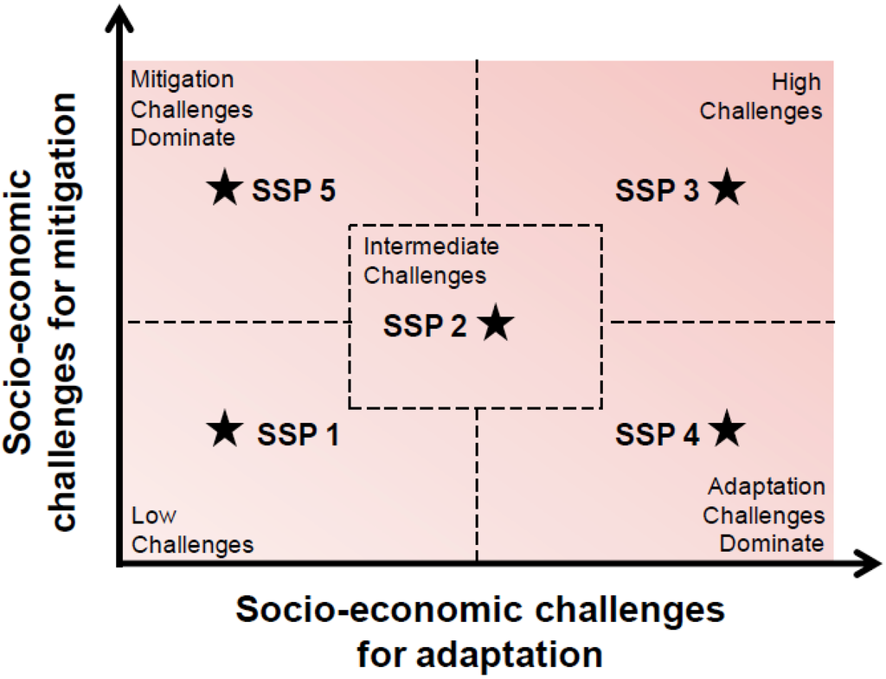
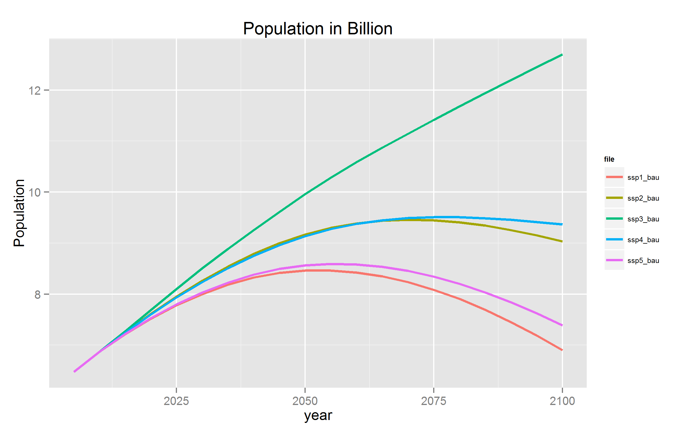
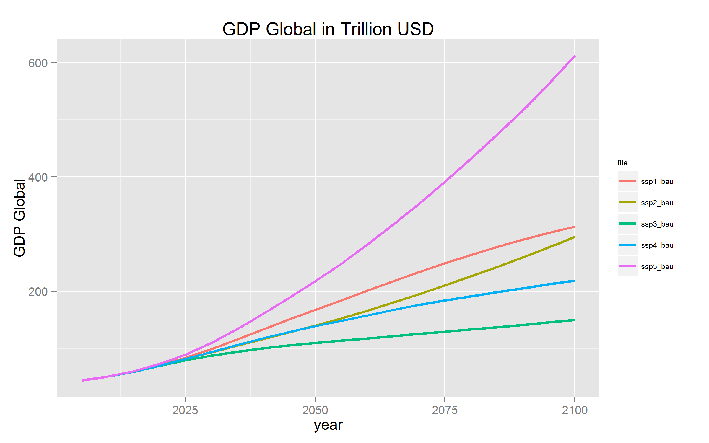
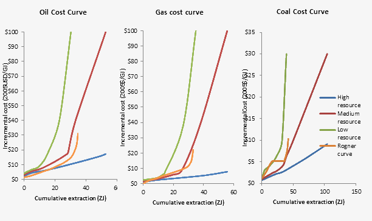

# Implementation of the SSPs

##  Implementation of the Shared Socioeconomic Pathways (SSPs)

This page presents the assumptions taken for the implementation of the Shared Socioeconomic Pathways (SSP) in the WITCH model.
The SSPs represent 5 different scenarios that have been qualitatively described through story lines and henceforth quantified. These scenarios are implemented matching the story lines and quantification throughout the WITCH model to generate the different scenarios.
Building on these scenarios, a baseline and four different policy targets have been formulated relying on the RCPs (Representative Concentration Pathways) which consist in four targets on total radiative forcing in 2100 of 2.6, 3.7, 4.5, and 6.0 W/m2.
The third dimension of the SSPs consists in a first-best global policy implementation starting immediately versus a second best delayed action policy, which can also differ across regions and is specified differently for each SSP.
These different policy architecture are referred to as Shared Policy Assumptions (SPAs).

The five SSPs are illustrated via the mapping in the challenges to mitigation/adaptation space:

### Gross Domestic Product (GDP) and Population

**Population** forecasts for the different SSPs are based on the common scenarios that have been developed at IIASA (International Institute for Applied Systems Analysis) and the OECD based on individual country forecasts. We use the OECD projection aggregated across WITCH regions.

Similarly, **GDP** baseline projections have been developed at the OECD. These GDP baseline forecasts are implemented using Purchasing Power Parities (PPP) and based on individual countries. We convert the data into USD using market exchange rates using the conversion factor of 2005 (also given by the OECD and assumed constant over time) and aggregate the series into WITCH regions. The GDP projected is then used to calibrate the time series of total factor productivity (''tfpy'') for the model.

All data series are given until the year 2100. Extrapolations until the time horizon of the models are based on linearly decreasing growth rates starting from 2100 towards zero at the end of the time horizon.
All of the baseline data can be accessed at the [SSP database](https///secure.iiasa.ac.at/web-apps/ene/SspDb). After adding some missing values for 2005 and 2010 and the PPP exchange rate, the total number of countries available from the database is 184.

### Energy Intensity

The dynamic calibration of factor productivity of energy services (''tfpn'') is run based on the SSP2. The following income elasticity rule is used for the different regions: industrialized countries (OECD members) are characterized by an elasticity of 0.40 in 2005 whereas non-OECD members have an elasticity of 0.55 based on the higher share of energy expenditures. To take into account economic progress and convergence, the elasticity is assumed to fall exponentially to finally reach a value of 0.2 in the year 2150.

Based on the obtained time series of regional energy productivity changes for SSP2, the same series is used for SSP4, and SSP5. Only for the "sustainable world" SSP1, the series is adjusted increasing the improvement in the factor productivity of energy by 1 percentage point per year to reflect the higher efficiency improvement in this scenario. Similarly, for the SSP3, the improvement is reduced by 1 percentage point per year to take into account slower energy efficiency improvement in this scenario. These values result in reasonable primary energy demand projections for the respective story lines and baseline GDP and population projections.

### Land-use

Land-use representation is carried out through a soft linkage with the land-use model GLOBIOM, so 
the representation of the SSP follows the GLOBIOM implementation.
GLOBIOM represents 3 pathways: SSP1, SSP2 and SSP3. Given identical mitigation challenge, 
SSP1 is also SSP4, and SSP3 is also SSP5.  

### Technology

The following matrix is applied to power technologies in the different SSP scenarios. "Low" indicates low penetration or high costs; "Medium" indicates the baseline assumptions; "High" indicates high penetration or low costs.

 | Technology | SSP1 | SSP2   | SSP3                            | SSP4                            | SSP5   | 
 | ---------- | ---- | ----   | ----                            | ----                            | ----   | 
 | CCS        | Low  | Medium | Medium                          | Medium (OECD) - High (non-OECD) | High   | 
 | Nuclear    | Low  | Medium | High (OECD) - Medium (non-OECD) | Medium (OECD) - High (non-OECD) | Medium | 
 | Renewables | High | Medium | Low                             | High                            | Medium | 

In the "High" cases, investment costs of CCS and nuclear plants decrese over time by 1%/yr; lower costs of CO2 and waste storage are applied to CCS and nuclear, respectively; concerning renewables, learning rates are increased by 50% and floor costs are reduced by 50%, additionally flexibility coefficients are reduced by 50% and a more relaxed version of the capacity constraint (i.e. without the capacity factor) is applied.

In the "Low" case, the opposite applies (except for learning rates which are decreased by 33%).

### Personal transport

The following matrix is applied to the different SSP scenarios in the transport sector.

 | Quantity                         | SSP1 | SSP2   | SSP3 | SSP4                         | SSP5   | 
 | --------                         | ---- | ----   | ---- | ----                         | ----   | 
 | Vehicle number                   | Low  | Medium | High | High                         | Medium | 
 | Travel intensity                 | Low  | Medium | High | High                         | Medium | 
 | Fuel efficiency improvement rate | High | Medium | Low  | High (OECD) - Low (non-OECD) | Low    | 
 | Battery learning progress factor | High | Medium | Low  | High                         | Low    | 

*  Vehicle number: OGE is multiplied by 0.8 in the Low cases, by 1.2 in the High cases;

*  Travel intensity: it decreases by 1%/5yr from 2015 in the Low cases, the opposite in the High cases;

*  Fuel efficiency improvement rate: it is -0.25 by default; it is multiplied by 3/2 in the High cases, by 4/5 on the Low cases;

*  Battery learning rate: it is 0.144 by default; it is multiplied by 5/4 in the High cases, by 2/3 in the Low cases.

### Air pollutant emissions

SSP are implemented under the form of a set of air quality emission factors following the SSP narratives for air pollution.

For the SSP implementation the countries are classified according to the their income, (income categories in fig.1.) and their emission factor path is computed. The countries are then regrouped by the WITCH regions, performing a weighted mean according to their GDP.

The emissions of the exo-sectors (sectors that are related to energy but are not accounted in the model directly, see [table](mod_air_quality)), are kept unchangeable throughout the different SSPs.

The pollutant NH$_3$ and some sectors such as Solvents, Waste (landfills, waste water, non-energy incineration), Agriculture waste burning on fields, Agriculture, Grassland burning and Forest burning are exogenous to the model. For the SSP implementation the emissions for these emission sectors vary over time following the average (across the WITCH sectors) variation of that given pollutant over time.

### Fossil Fuel Resources

The fossil fuel supply curves are taken from the [ROSE project](http://www.rose-project.org/), which developped High/Medium/Low supply curves for oil, coal, and gas reserves.

 | SSP  | Oil    | Gas    | Coal   | 
 | ---  | ---    | ---    | ----   | 
 | SSP1 | Low    | Low    | Low    | 
 | SSP2 | Medium | Medium | Medium | 
 | SSP3 | High   | High   | High   | 
 | SSP4 | Low    | Medium | Medium | 
 | SSP5 | Low    | High   | High   | 

The supply curves have been approximated regionally using nth-order polynomials.

