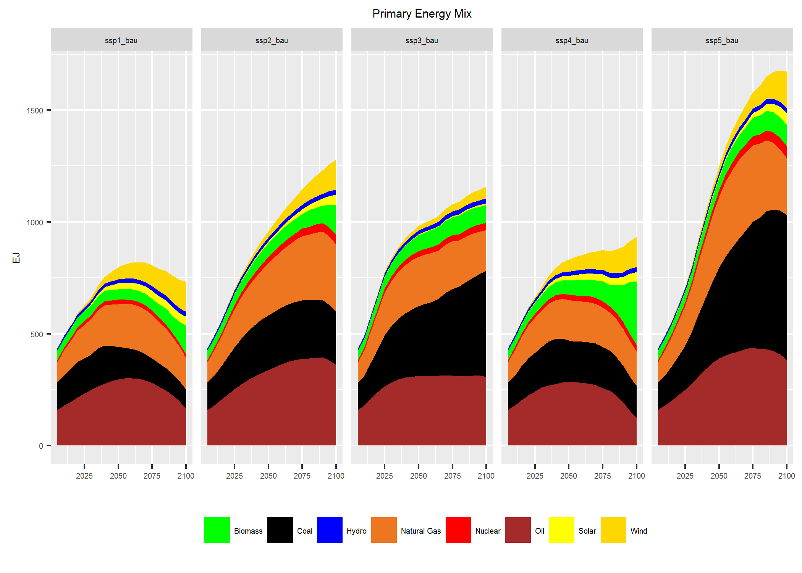
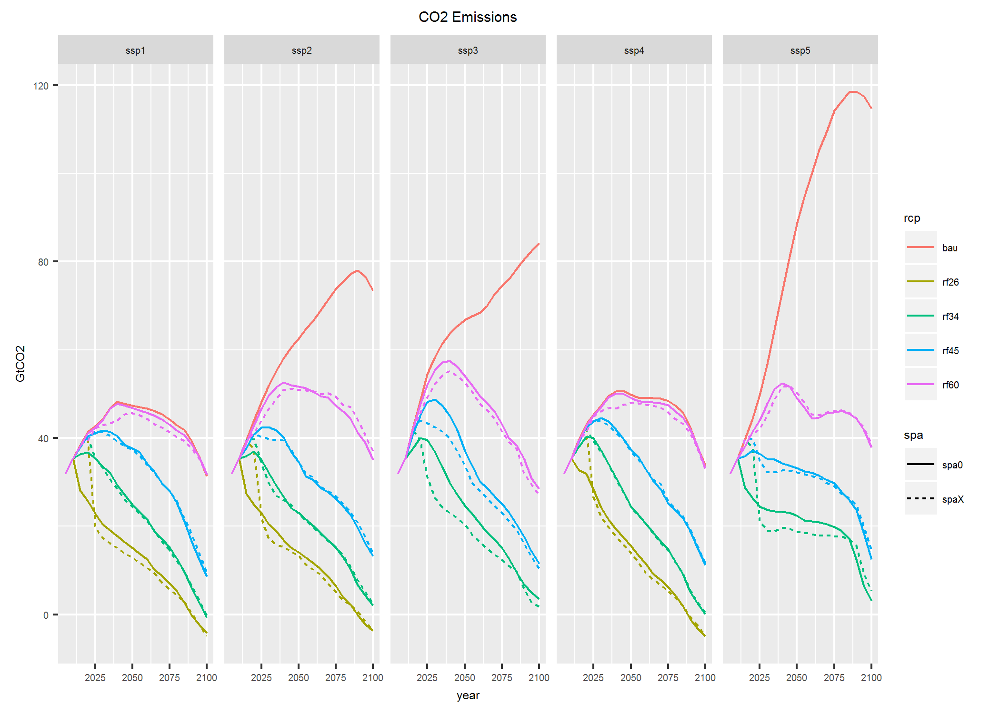
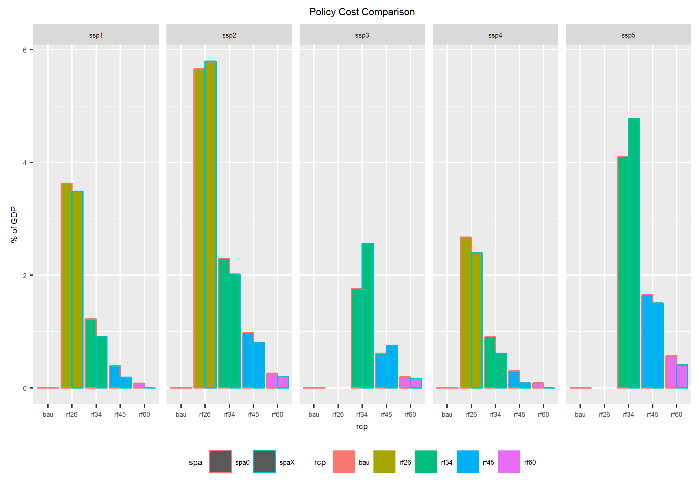

#  Results for the Shared Socioeconomic Pathways (SSPs)

This page presents shows the main results of the SSP implementations in WITCH. For further results and comparison with other IAMs, see the Special Issue in Global Environmental Change.

## Energy

**Energy** supply across the different SSPs in the reference (bau) scenario reflect the implementations of the story lines of rhte five SSPs. In terms of Total Primary Enegry Supply SSP1 and SSP4 show the lowest total energy demand while SSP5 has the highest demand at about 1600 EJ by the end of the century. SSP2 and 3 are in between those two extremes.
Moreover, with respect to the Energy Mix, different fossil fuel reserves assumptions lead to a higher permanence of fossil fuel dependenc in SSP3 and 5 whereas notably in SSP1 renewables are becoming increasingly competitive.

## Emissions

Together with the climate policies according to the different RCPs (including an intermediate RCP34 forcing target of $3.4W/m^2$), **CO2 Emissions** differ across SSPs following the assumptions about fossil fuel consumption and land-use emissions, and different challenges to mitigation. Notably, the potential to net-negative emissions mainly through bioenergy with CCS is visible notably in SSP2 and SSP1.

## Policy costs

This emission pathways translate into different resulting policy costs of the different targets in terms of ratiative forcing. The policy costs are lower in the sustainable scenario SSP1 and the scenario with low baseline growth SSP4. IN SSP5 on the other hand with radip expansion of energy demand including fossil fuel resource use, policy costs are substantially higher than in the other SSPs (Note that the most stringent RCP26 policy turned out to be infeasible within the SSP scenario iN WITCH). 

