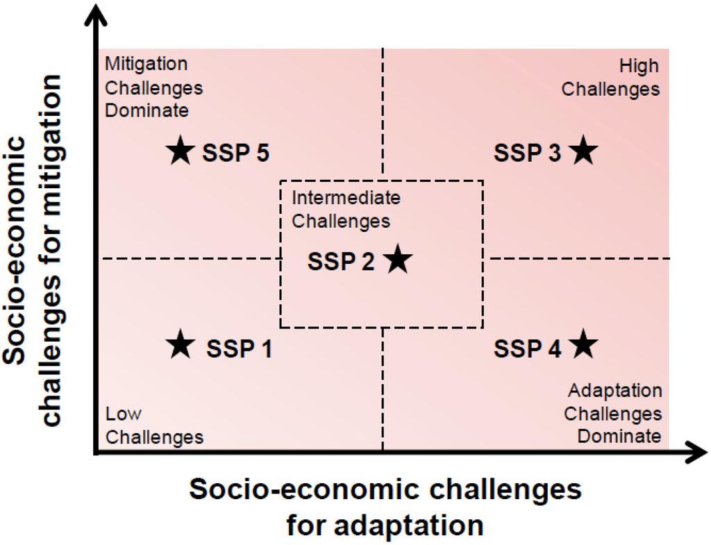

#  Results for the Shared Socioeconomic Pathways (SSPs)

This page presents shows the main results of the SSP implementations in WITCH. For further results and comparison with other IAMs, see the Special Issue in Global Environmental Change.

## Gross Domestic Product (GDP) and Population

**Population** forecasts for the different SSPs are based on the common scenarios that have been developed at IIASA (International Institute for Applied Systems Analysis) and the OECD based on individual country forecasts. We use the OECD projection aggregated across WITCH regions.

Similarly, **GDP** baseline projections have been developed at the OECD. These GDP baseline forecasts are implemented using Purchasing Power Parities (PPP) and based on individual countries. We convert the data into USD using market exchange rates using the conversion factor of 2005 (also given by the OECD and assumed constant over time) and aggregate the series into WITCH regions. The GDP projected is then used to calibrate the time series of total factor productivity (''tfpy'') for the model.

